<style>
div.python pre { background-color: #e9f7f5
; }
</style>

<style>
div.r pre { background-color: #fff5fd; }
</style>


# PEP8


Check this video : https://www.youtube.com/watch?v=hgI0p1zf31k

The link below exposes a style guide for python, I strongly recommend that you read these guidelines before sending your project. It will be helpful to improve the readability of the code. 


https://www.python.org/dev/peps/pep-0008/#introduction

Here are a few short quotes from the guide :

- One of Guido's key insights is that code is read much more often than it is written. As PEP 20 says, "Readability counts".

- A style guide is about consistency. Consistency with this style guide is important. Consistency within a project is more important. Consistency within one module or function is the most important.

- Limit all lines to a maximum of 79 characters.

- Spaces are the preferred indentation method.

- Indentation : Use 4 spaces per indentation level, no tabs. Continuation lines should align wrapped elements either vertically using Python's implicit line joining inside parentheses, brackets and braces, or using a hanging indent

<div class = "python">

```{python , eval=F}
# Correct:

# Aligned with opening delimiter.
foo = long_function_name(var_one, var_two,
                         var_three, var_four)

``` 


```{python , eval=F}
# Wrong:

# Arguments on first line forbidden when not using vertical alignment.
foo = long_function_name(var_one, var_two,
    var_three, var_four)

``` 

- When the conditional part of an if-statement is long enough to require that it be written across multiple lines:


```{python , eval=F} 
# Acceptable

# No extra indentation.
if (this_is_one_thing and
    that_is_another_thing):
    do_something()


# Add some extra indentation on the conditional continuation line.
if (this_is_one_thing
        and that_is_another_thing):
    do_something()

```


- Should a Line Break Before or After a Binary Operator?

```{python , eval=F} 
# Wrong:
# operators sit far away from their operands
income = (gross_wages +
          taxable_interest +
          (dividends - qualified_dividends) -
          ira_deduction -
          student_loan_interest)
``` 

```{python , eval=F}
# Correct:
# easy to match operators with operands
income = (gross_wages
          + taxable_interest
          + (dividends - qualified_dividends)
          - ira_deduction
          - student_loan_interest)

```

- imports :

```{python , eval=F}
# Correct:
import os
import sys

# Correct:
from subprocess import Popen, PIPE

# Wrong:
import sys, os
``` 

- Whitespace in Expressions and Statements :

```{python , eval=F}
# Correct:
spam(ham[1], {eggs: 2})

# Wrong:
spam( ham[ 1 ], { eggs: 2 } )

``` 

```{python , eval=F}
# Correct:
if x == 4: print x, y; x, y = y, x

# Wrong:
if x == 4 : print x , y ; x , y = y , x
``` 


- More than one space around an assignment (or other) operator to align it with another:

```{python , eval=F} 
# Correct:
x = 1
y = 2
long_variable = 3

# Wrong:
x             = 1
y             = 2
long_variable = 3
```


- Operators 

```{python , eval=F}
# Correct:
i = i + 1
submitted += 1
x = x*2 - 1
hypot2 = x*x + y*y
c = (a+b) * (a-b)
``` 

```{python , eval=F} 
# Wrong:
i=i+1
submitted +=1
x = x * 2 - 1
hypot2 = x * x + y * y
c = (a + b) * (a - b)
```

- Don't use spaces around the = sign when used to indicate a keyword argument, or when used to indicate a default value for an unannotated function parameter:

```{python , eval=F} 
# Correct:
def complex(real, imag=0.0):
    return magic(r=real, i=imag)
```


```{python , eval=F}
# Wrong:
def complex(real, imag = 0.0):
    return magic(r = real, i = imag)
```

- Compound statements (multiple statements on the same line) are generally discouraged:

```{python , eval=F} 
# Correct:
if foo == 'blah':
    do_blah_thing()
do_one()
do_two()
do_three()
```

```{python , eval=F}
# Wrong:
if foo == 'blah': do_blah_thing()
do_one(); do_two(); do_three()
```

- When trailing commas are redundant..the pattern is to put each value (etc.) on a line by itself, always adding a trailing comma, and add the close parenthesis/bracket/brace on the next line. 

```{python , eval=F}
# Correct:
FILES = [
    'setup.cfg',
    'tox.ini',
    ]
initialize(FILES,
           error=True,
           )
```

```{python , eval=F}
# Wrong:
FILES = ['setup.cfg', 'tox.ini',]
initialize(FILES, error=True,)
```

- Conventions for writing good documentation strings (a.k.a. "docstrings") are immortalized in PEP 257.  \textbf{Write docstrings for all public modules, functions, classes, and methods.}

```{python , eval=F}
"""Return a foobang

Optional plotz says to frobnicate the bizbaz first.
"""
``` 

```{python , eval=F}
"""Return an ex-parrot."""

```

- Never use the characters 'l' (lowercase letter el), 'O' (uppercase letter oh), or 'I' (uppercase letter eye) as single character variable names.

- Function names should be lowercase, with words separated by underscores as necessary to improve readability.

-Variable names follow the same convention as function names.

- Constants are usually defined on a module level and written in all capital letters with underscores separating words. Examples include MAX_OVERFLOW and TOTAL.

```{python , eval=F}
PATH = '/my/path'
```


-Use is not operator rather than not ... is. While both expressions are functionally identical, the former is more readable and preferred:

```{python , eval=F}
# Correct:
if foo is not None:


# Wrong:
if not foo is None:
```


- Always use a def statement instead of an assignment statement that binds a lambda expression directly to an identifier:

```{python , eval=F}
# Correct:
def f(x): return 2*x


# Wrong:
f = lambda x: 2*x
```


- Additionally, for all try/except clauses, limit the try clause to the absolute minimum amount of code necessary. Again, this avoids masking bugs:

```{python , eval=F}
# Correct:
try:
    value = collection[key]
except KeyError:
    return key_not_found(key)
else:
    return handle_value(value)
```

```{python , eval=F}
# Wrong:
try:
    # Too broad!
    return handle_value(collection[key])
except KeyError:
    # Will also catch KeyError raised by handle_value()
    return key_not_found(key)
```


- For sequences, (strings, lists, tuples), use the fact that empty sequences are false:

```{python , eval=F}
# Correct:
if not seq:
if seq:


# Wrong:
if len(seq):
if not len(seq):
```


- Don't compare boolean values to True or False using ==:

```{python , eval=F}
# Correct:
if greeting:


# Wrong:
if greeting == True:
```


</div>

# Rmarkdown

Rmarkdown allows you to generate html, pdf and even word files. You can easily integrate R as Python and make your analyses in the document in order to communicate your code or their outputs (e.g. automate a report).

Unlike latex and html markdown is very easy to read in its raw state. The layout, titles, tables etc... are very easy to handle and do not hinder readability.

Before going deeper into details, see how to easily create an html or a pdf (or others) with Rmarkdown using R studio: 

\centering

## Create a new Rmarkdown document

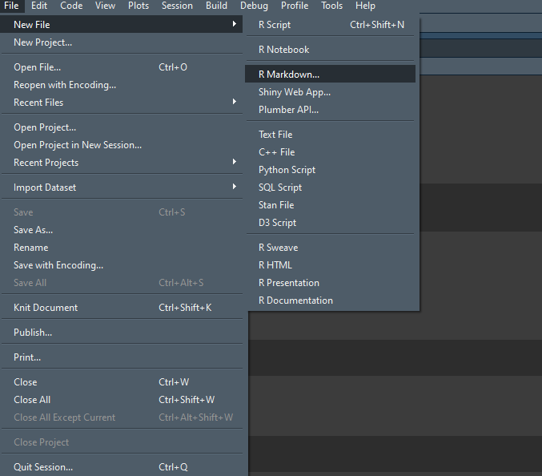

- Fill name and title


- It automaticcaly creates a report example


- Modify the file structure, see how you can put both r and python code in your report


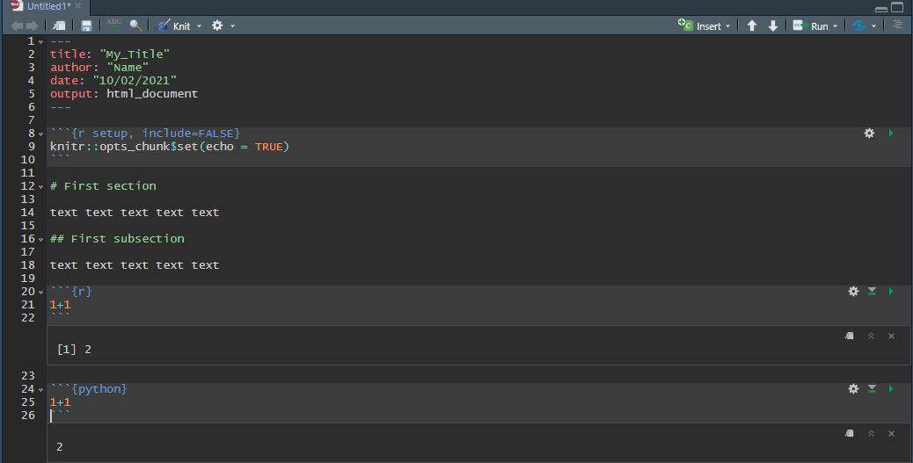

- To create the html document clic on 'knit', you can choose html or pdf as outputs (and others).


- See the results in html 


- in PDF 

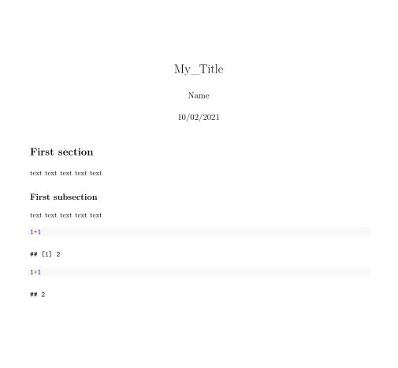


## Rmarkdown structure

Check this cheatsheet: https://rstudio.com/wp-content/uploads/2016/03/rmarkdown-cheatsheet-2.0.pdf

### YAML Header

The header of a Rmarkdown file is by default structured as follow :

```
---
title: "My Title"
author: "Name"
date: "10/02/2021"
output: html_document
---
```

- You can remove some if you don't want the date to be in the document for example. You can also specify more details to custom the output. For example you may want to add the table of contents at the begining of your document, the YALM will be then :
```
---
title: "My Title"
author: "Name"
date: "10/02/2021"
output:
  html_document:
    toc: true
    number_sections: true
---
```

- You can add an abstract to your document directly in the YAML header :


```
---
author: "Name"
abstract: "Abstract"
output:
  pdf_document:
    toc: true
    number_sections: true
---
```

- You can change the theme of your html output choosing in this list : https://bootswatch.com/3/ For example, the theme of this website is Flatly.


```
---
output:
  html_document:
    theme: flatly
---
```

- More information here for html document: https://bookdown.org/yihui/rmarkdown/html-document.html


### Text

 - To create a title in markdown you need to use a ```#``` each ``#`` represents a title level. ```##``` returns a level two title.
 
 - To create a new paragraph just end a line with two spaces. Otherwise you can skip a line to start a new paragraph but there will be a space between the two paragraphs.
 
 - To write in italics or bold you only have to specify one ```*``` or two ```**``` respectively.
 
 - Escaped character (remember it from chap 3 ;) ) must be specified with a \\ before. ```\*``` give \*
 
 - To write example of code without running it like this ```import numpy as np``` just use ```` ```import numpy as np``` ````
 
 - Show image from your computer in the output ``````
 
 - You can write directly in html, for example add a link to an external webpage : ```<a href="https://www.google.com/">Google</a>```
 
 - You can write in $\LaTeX$: $\frac{1}{2}$ . You just need to write the equation between two ```$```
 
 - To make bulletpoints like this:
     - here 
         - and here, please use * then + then - for different levels. Also just using - and four whitespaces for each level works also.
 
### Code chunks

- By default the first chunk is about chunk options. It is presented like this :

```
knitr::opts_chunk$set(echo = TRUE)
```

- You can set there chunk option for all you document, you can specify if we will see the code, the output, warnings, errors etc etc. Please see all options on the cheatsheet.

- As you noted a chunk start with ```` ```{} ````. First you specify the language used within the chunk and then the title of the chunk, after the comma, specify options for the given chunk :  
```` ```{r chunk1, error = T} ````


### Slides

- You can create slides directly with Rmarkdown also , ioslide and slidy will be used to create html slides, which are cool if you want to put interactive stuff in your slides, otherwise beamer can be used for static presentation in pdf

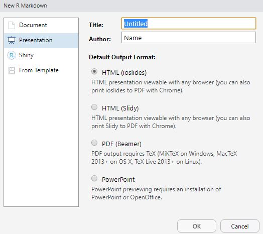


- To create a new slide just type ```---``` between two empty lines or create a new title.


## Execute rmd automatically

- From R :

```rmarkdown::render('C:/Users/Beta/Documents/GitHub/M1_TDP/examples/Markdown/test.Rmd', 'pdf_document')``` 

- From Shell:

```R -e "rmarkdown::render('C:/Users/Beta/Documents/GitHub/M1_TDP/examples/Markdown/test.Rmd', 'pdf_document')"```

- From Python :

<div class = "python">

```{python, eval = F}
import os 
os.system('''R -e "rmarkdown::render('C:/Users/Beta/Documents/GitHub/M1_TDP/examples/Markdown/test.Rmd', 'pdf_document')" ''')
```

</div>

# GitHub

Github is a company that creates products that use the open source tool git.
From wikipedia: "Git is a distributed version-control system for tracking changes in any set of files, originally designed for coordinating work among programmers cooperating on source code during software development.".


## Create a repository

A repository is usually used to organize a single project. Repositories can contain folders and files, images, videos, spreadsheets, and data sets etc, etc.

- On your GitHub account create a new repository:


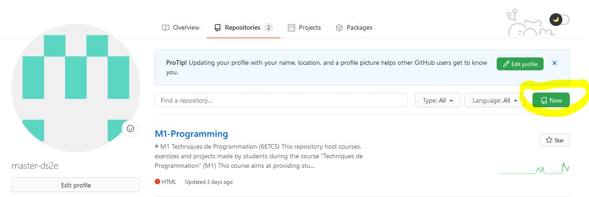

- Name the project, Add a README, gitignore is used to ignore some files format that are stored in the same folder on your computer. 


- Now that you have a repository, you may want to invite people to collaborate with you and give them writing rights to the project. Conversely, these collaborators can also clone the project and then ask to attach their versions to yours afterwards. 


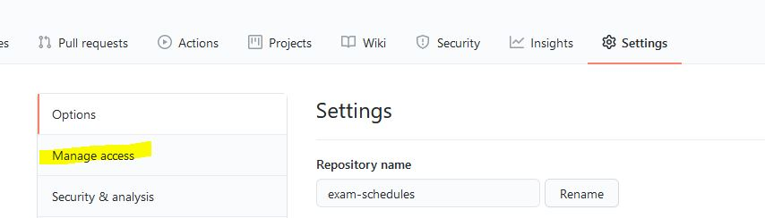

- Invite a collaborator 

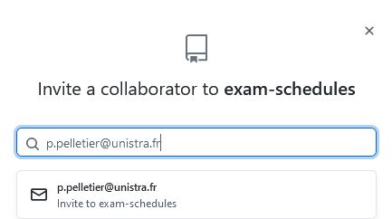

## Clone a repository

- If you are not the creator of the repository, you can clone the repository to have it on your computer and then modify the project. In the same way you can easily use other people's programs by cloning their repository.


## Create branches

- Now that the directory is created, collaborators can work on it and contribute to the project. The final version of the project can be found on the 'main' branch.

- You can create a branch in order to start editing the project and save your changes on your own branch. Often branches will be linked to specific aspects of the project and will then be removed once the changes have been integrated into the final version.


- You can publish this branch if you want it to be merged to the main branch after your changes.

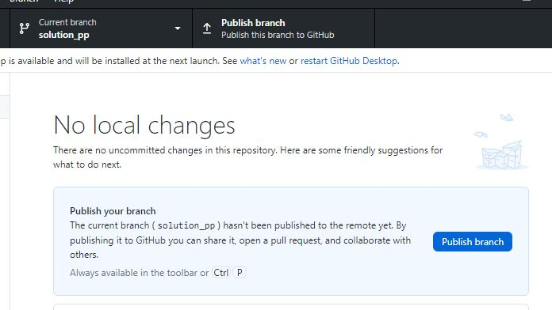

## Commit your changes


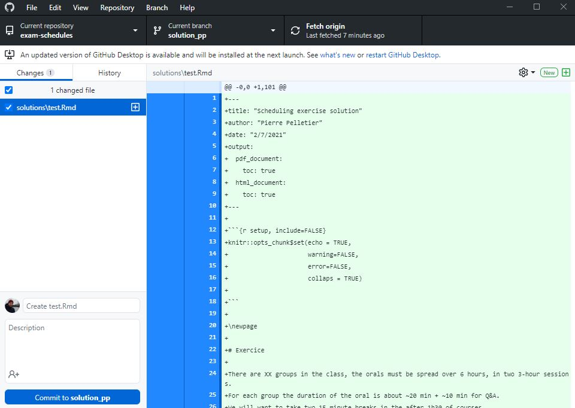

- Once you have finished your changes for the day but you are still not at the stage where your branch has to be merged with the main branch you can push your commits to save them and make them available to the other one (still on your branch).


- On github you can see the project as well as the two branches that compose it

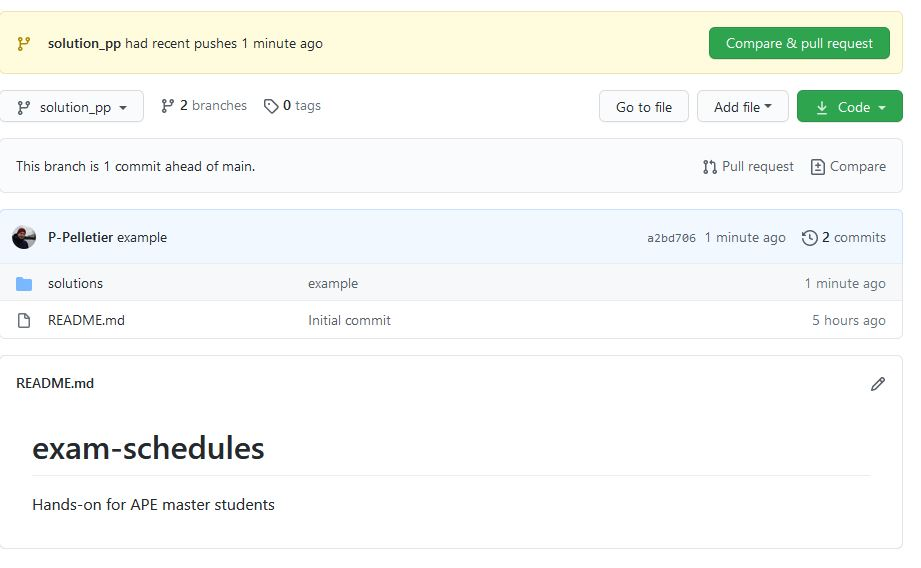

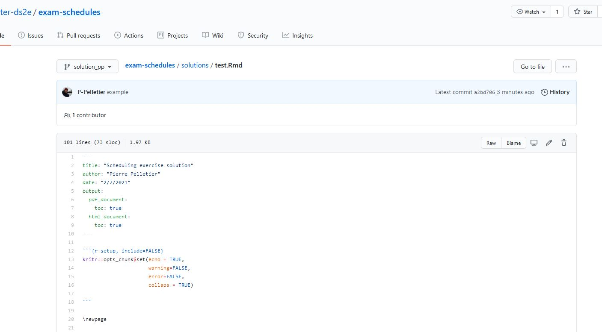

## Create Pull Request

- Once your changes are complete you can now submit your changes to the community and create a pull request. 


- This will signal to others that your changes are ready and that adding them to the final project needs to be discussed. You can also check the changes approved by the main branch before merging them.

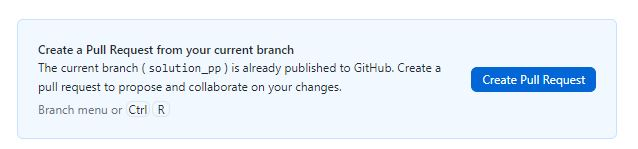


- Then the authors of the repository will be able to approve or not the merge of the two branches. As I'm a collaborator of the project I can do it by myself. 

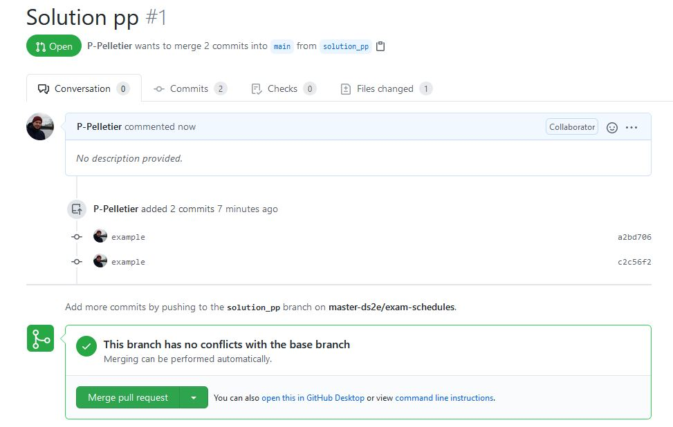


- Once the modifications are validated, you can delete the branch that was created for the occasion.


- So we only have one branch left in our repository with the modifications made on the solutions folder.


- Keeping your folder update

- If you are working on different aspects of your project you probably want to integrate into your computer folder the changes made by your collaborators, so you should regularly check if any changes have been made to a given branch and pull origin if necessary. Make sure you check the changes made to the files before doing it!


# Exercise

Clone this repository and follow the instructions: https://github.com/master-ds2e/exam-schedules

