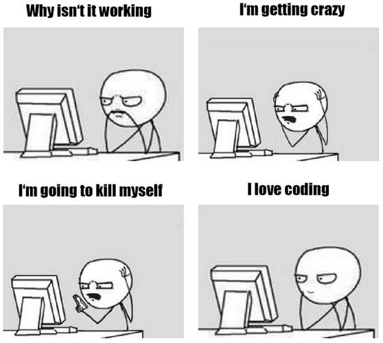

\newpage

# Examen écrit 

- \textbf{16 Mars 9h-11h | Coeff : 1/3 (2ECTS)}

- L'examen se déroulera sur ordinateur et en présentiel.

- Prévoyez votre ordinateur, mais j'ai demandé à avoir une salle info (je ne pense pas que Python y soit installé).

- Sur votre ordinateur soyez sûr d'avoir les packages/modules déjà installés (dommage de perdre du temps pour les télécharger lors de l'exam).

- Vous pouvez utiliser toutes les ressources à votre disposition !

- Qu'est ce qu'il y a dans l'examen ?
    - Chercher les fautes dans un script R et Python.
    - Quelques petits exercices faisant intervenir des boucles et des conditions.
    - Création/modification de variables dans une base de données (character et numeric).
    - Répondre et me rendre un .html généré via Rmarkdown de manière à ce que je puisse voir le code et l'output directement.

# Projet

- \textbf{Rendu le 22 Mars à minuit dernier délais /!\symbol{92} sinon 0 | Coeff : 1/3 (2ECTS)}

- Comme précisé en cours vous devez créer un outil qui automatisera une ou plusieurs tâches, faites-vous plaisir.

- Regroupez vos fonctions dans des scripts dédiés à leurs utilités (par exemple si vous avez un ensemble de fonctions dédiées au cleaning de data, mettez toutes ces fonctions dans un script clean_data.py/R et importez-les depuis le script principal de votre outil).

- Le projet doit être rendu disponible sur votre GitHub le 22 Mars à minuit.

- Vous devez rediger un README détaillé pour expliquer le but de votre outil et comment le faire fonctionner. Je dois pouvoir comprendre votre projet et sa structure à partir du readme.

# Oral (~ 20 min)

- \textbf{23/24 Mars 9h-12h | Coeff : 1/3 (2ECTS)}

- Venez avec votre ordinateur prêt à nous faire une démonstration de votre outil.

- Expliquez clairement votre projet aux autres étudiant.es, permettez-leur de ressortir de ces oraux avec de nouvelles idées de projet.

- Créez des slides avec Rmarkdown dans lesquelles vous parlerez de la structure de votre répertoire sur GitHub en explicitant les differentes étapes de l'élaboration de votre outil. 

- Montrez les parties du code qui vous semblent importantes et/ou qui vous ont posé problème, donnez-nous des armes pour ne pas avoir les mêmes difficultés que vous, si l'envie nous prend un jour de faire un projet similaire.

# But du cours / Ce que vous devez retenir

- Vous exposer à differents outils pour vous montrer qu'ils existent et vous initier à leur utilisation.
    
- Savoir coder c'est surtout savoir utiliser google et stack overflow.

- Vous pouvez faire tout ce que vous voulez avec la programmation et quelqu'un la certainement déjà fait avant vous.
    
- Il faudra à l'issue du cours être en mesure de :
    - Créer des processus itératifs (boucles) et mettre en place des conditions.
    - Utiliser/modifier les differents types d'objects dans R et Python (list, dict, matrix, tibble, dataframe ..)
    - Rendre votre code plus flexible en utilisant des fonctions. (Exo chap 1/2/3 pour les exemples) 
    - Manipuler grossièrement des chaines de caractères et comprendre que certains schemas peuvent être repérés pour extraire/nettoyer facilement de l'information. (Exo chap3/4 pour les exemples)
    - Comprendre que les mêmes tâches peuvent être réalisées de différentes manières et que certaines méthodes sont plus efficaces que d'autres.
    - Savoir rendre disponible vos codes sur GitHub et savoir communiquer leurs outputs.

# Si vous n'avez pas tout compris

- Vous ne devez pas connaitre mon cours sur le bout des doigts, cela n'a aucun sens puisqu'internet vous sera accessible le jour de l'examen !

- Je reste disponible pour vous accompagner durant le mois qui séparera le derniers cours et l'examen, contactez-moi ! (Vraiment!)

- Ceci est votre premier cours de programmation, pas d'inquiétude vous allez progresser et être à l'aise à l'issue de votre master. Gardez cette image en tête :
   
\centering
{ width=60% }

